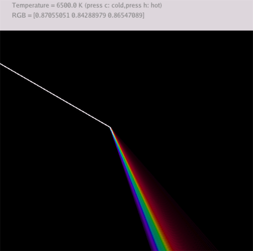

# 太极图形课S1-【作业6】黑体辐射_折射色散

## 背景简介
黑体辐射（Blackbody Radiation )指处于热力学平衡态的黑体发出的电磁辐射。黑体辐射的电磁波谱只取决于黑体的温度。

随着温度的变化，黑体辐射的可见光光谱可以通过折射色散现象观察。

使用taichi编程语言，模拟上述过程。

## 成功效果展示

温度为6500K的模拟效果



温度变化的模拟效果


## 运行方式
```
git clone git@github.com:kphmd/BlackbodyRadiation.git
cd BlackbodyRadiation
python3 blackbody_radiation.py
```
